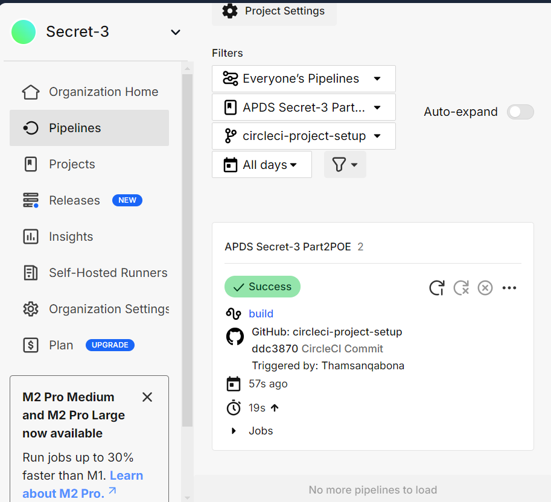
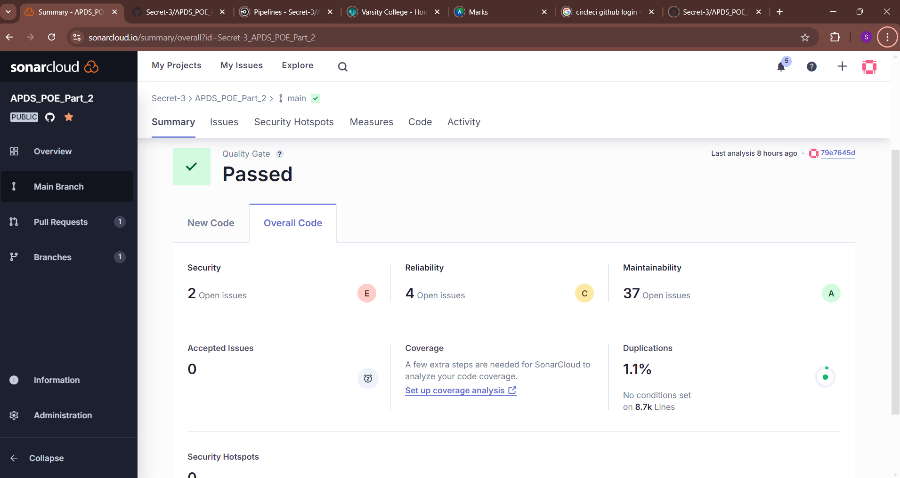

# GlobalTrust Bank - International Payment Portal

## Version
Version 1.0 

## Demo Video Link:
https://www.youtube.com/watch?v=fmwCxnRlEa0

-----------------------------------------------------------------------------------------------------------------------------------------------------------------------
## Introduction
<<<<<<< Updated upstream
=======
!()
>>>>>>> Stashed changes

GlobalTrust Bank offers a state-of-the-art international payment portal designed to meet the evolving needs of customers in a globalized financial landscape. As international transactions become increasingly common, the demand for a reliable, efficient, and secure payment platform is paramount. Our portal empowers customers to manage their international payments conveniently and securely.

Users can easily navigate the portal to register their accounts, log in with their credentials, and initiate transactions with confidence. By utilizing the SWIFT network, which is a global standard for international banking transactions, we ensure that users can send money across borders with ease and reliability. The platform incorporates robust security measures to protect sensitive financial data, including full names, ID numbers, account numbers, and passwords. GlobalTrust Bank prioritizes the safety and integrity of customer information, making it a trustworthy option for anyone looking to conduct international payments.

-----------------------------------------------------------------------------------------------------------------------------------------------------------------------
## Purpose

The primary purpose of the GlobalTrust Bank international payment portal is to facilitate seamless international transactions while ensuring the highest level of security for customer data. In today’s digital economy, the ability to send and receive money internationally is essential for businesses and individuals alike. Our portal aims to streamline this process, eliminating unnecessary complexity and enabling customers to focus on their financial goals.

By offering a user-friendly interface, the portal provides an accessible solution for customers of all experience levels. The registration and login processes are designed to be intuitive, ensuring that users can easily set up and access their accounts. Once logged in, customers can efficiently manage their payments, select currencies, and choose providers, all while adhering to stringent security protocols.

-----------------------------------------------------------------------------------------------------------------------------------------------------------------------
## Features Implemented

- User Registration: Customers can register by providing their full name, ID number, account number, and password.
- Secure Login: Users log in using their username (email), account number, and password.
- Transaction Processing: Users can enter the amount to be paid, choose the currency, and select a payment provider.
- Account Information Submission: Customers enter the recipient's account information and SWIFT code before finalizing the payment.
- Transaction Storage: All transactions are securely stored in a database for record-keeping and review.
  
- Employee Pre-Registration: Bank employees are pre-registered on the portal upon employment, eliminating the need for additional registration steps.
- Secure Employee Login: Employees log in securely to access the system and view transactions that require processing.
- Transaction Review and Verification: Employees can review transaction details, verify payee account information, and ensure that the provided SWIFT code is correct.
- Transaction Authorization: A 'Verified' button is available next to each transaction, allowing employees to mark it as verified before submission.
- SWIFT Submission: Once verified, employees can click the 'Submit to SWIFT' button to forward the transaction for payment, completing the process on the portal.

---------------------------------------------------------------------------------------------------------------------------------------------------------------------
## Prerequisites

Node.js (version 14 or later)
MongoDB
A code editor (e.g., Visual Studio Code)


---------------------------------------------------------------------------------------------------------------------------------------------------------------------
## Built With

Frontend: JavaScript, React, SCSS, CSS, HTML
Backend: Node.js, Express
Database: MongoDB
Development Tools: Visual Studio Code, Git

---------------------------------------------------------------------------------------------------------------------------------------------------------------------
## Installation

To set up the GlobalTrust Bank international payment portal on your local machine, follow these detailed steps. 

Cloning the Repository
1. Open your terminal and navigate to the directory where you want to clone the project.
2. Clone the repository using the following command:
   ```
   git clone https://github.com/Secret-3/APDS_POE_Part_2.git
   ```
3. Navigate into the cloned directory:
   ```
   cd APDS_POE_Part_2
   ```
then 
```
   cd "GlobalTrust Bank"
   ```

Installing Dependencies
1. The project has a client-side and server-side structure. Navigate to the client directory and install the required dependencies:
   ```
   cd client
   npm install
   ```

2. Next, navigate to the server directory and install the required dependencies:
   ```
   cd ..
   cd into server
   run "node index.js"
   ```
   
4. Run the Client:

Once the dependencies are installed, go back to the client folder:

```
cd client
   run "yarn dev"
   ```


This will start the frontend in development mode. It should provide a URL where you can access the frontend, usually something like http://localhost:3000 or http://localhost:5173.

4. Run the Server:
Open a new terminal and navigate to the server folder and start the server application:
```
   cd server
    npm start
   ```
Once both the client and server are running, the frontend will communicate with the backend.

Here's the revised **Usage** section with the new information for the bank employees included:

---

## Usage

1. **Registration**:
   - **For Users**: Navigate to the registration page in your browser. Fill in your full name, ID number, account number, and password. This information will be securely stored in the database.
   - **For Employees**: Employees of the bank are pre-registered on the portal when they join the bank, so no registration process is necessary for them. They simply need to log in to access and manage transactions.

2. **Login**:
   - After registering (for users) or for pre-registered employees, navigate to the login page.
   - Enter your username, account number, and password to log in.

3. **Making Payments** (For Users):
   - Once logged in, you will have the option to enter the payment amount, select the relevant currency, and choose a payment provider (e.g., SWIFT).
   - Fill in the required account information and SWIFT code for the transaction.
   - Click on **Pay Now** to finalise the payment process.

4. **Transaction Verification** (For Employees):
   - After logging in, employees can view transactions that require verification and forwarding to SWIFT for payment.
   - Check the payee's account information and ensure the SWIFT code is correct.
   - To complete a transaction, click the **Verified** button next to each entry.
   - Once all entries are verified, click **Submit to SWIFT** to forward the transactions for final processing. This action completes the employee’s role in the payment process.

5. **Stopping the Servers**:
   - To stop the servers, return to the terminal windows running the server and client, and press `Ctrl + C` in each window.

- Troubleshooting
- If you encounter issues with missing dependencies or errors during startup, ensure that you have installed all required packages in both the client and server directories.

---------------------------------------------------------------------------------------------------------------------------------------------------------------------
## Functional Requirements

### User Functional Requirements
- Users must register with their full name, ID number, account number, and password.
- Users must log in using their username (email), account number, and password.
- The portal should allow users to enter the amount, choose the currency, and select a payment provider.
- Users must provide the recipient's account information and SWIFT code.
- The system should securely store transaction data in the database.

### Admin Functional Requirements
- Employees of the bank are pre-registered on the portal upon employment, with no registration required.
- Employees must log on to the system to review transactions, verify payee account information, and ensure the SWIFT code is correct.
- Employees complete transaction verification by clicking a “Verified” button next to each entry.
- After verifying all necessary details, employees submit transactions to SWIFT by clicking the “Submit to SWIFT” button, which finalises the transaction process within the portal.

---------------------------------------------------------------------------------------------------------------------------------------------------------------------
## Non-Functional Requirements

Security: All sensitive data must be encrypted and securely stored.
Performance: The portal should handle multiple transactions simultaneously without significant delays.
Usability: The user interface must be intuitive and easy to navigate.


---------------------------------------------------------------------------------------------------------------------------------------------------------------------

## Integrating GitHub Workflows with CircleCI and SonarCloud for DevSecOps

At GlobalTrust Bank, our approach to developing the international payment portal centres on a strong DevSecOps foundation. Integrating GitHub workflows with CircleCI and SonarCloud has been key in making security an essential part of our software development lifecycle—right from the start, rather than an afterthought.

### CircleCI for Smooth CI/CD Pipelines

CircleCI drives our continuous integration and deployment, which allows us to release software quickly without compromising on quality. Here’s how CircleCI helps:

1. **Automated Testing**: CircleCI automatically runs our unit, integration, and end-to-end tests whenever we push code. This ensures that any potential issues, including security vulnerabilities, are caught as early as possible, helping us maintain strong quality standards.

2. **Build Automation**: Every time we push code, CircleCI triggers a new build. This makes sure that our application is always in a deployable state, speeding up the release process and reducing the chance for errors.

3. **Environment Consistency**: By managing our environment configurations, CircleCI ensures consistency between development, testing, and production. Having a consistent environment across all stages is essential for security, as it reduces unexpected issues that can create vulnerabilities.

### SonarCloud for Continuous Code Quality and Security

SonarCloud is integrated into our GitHub workflows to monitor the quality and security of our code continuously. It plays a big role in keeping our codebase secure and healthy by:

1. **Quality Checks**: SonarCloud continuously analyses the code for bugs, security issues, and areas that could be improved. This allows us to fix problems quickly, reducing the chance of any flaws that could pose security risks.

2. **Vulnerability Scanning**: SonarCloud’s scanning tools actively look for known vulnerabilities and provide developers with suggestions to address them. This means we can fix issues long before they reach production.

3. **Managing Technical Debt**: SonarCloud helps us track technical debt, so we can prioritise improvements and address them over time. This way, we keep our codebase in good shape, reducing the chance that neglected code will become a security issue.

4. **Pull Request Feedback**: By linking SonarCloud with GitHub pull requests, we give developers real-time feedback on code quality and security. This helps foster a proactive approach to security across the team, creating a shared responsibility for keeping the code secure.

### Payment Portal Workflow for Employees

For GlobalTrust Bank employees, the payment portal process is streamlined and secure. Employees are pre-registered when they’re hired, so there’s no need to set up individual accounts. Once logged in, they can verify transactions and send them to SWIFT for processing. The steps are:

- **Verifying Information**: Employees first check the payee’s details to make sure everything is accurate, including the SWIFT code.
- **Transaction Approval**: After verifying, they click a “Verified” button next to each transaction entry to confirm accuracy.
- **Submitting to SWIFT**: Finally, employees complete the process by clicking “Submit to SWIFT,” ensuring that the transaction is correctly forwarded.

### Continuous Improvement and Team Collaboration

By automating repetitive tasks and giving immediate feedback, the combination of CircleCI and SonarCloud enables our developers to focus on writing secure, high-quality code. This setup aligns with DevSecOps best practices, creating a culture where security is everyone’s responsibility, not just something tacked on at the end.

### In Summary

Bringing together GitHub workflows with CircleCI and SonarCloud strengthens our DevSecOps approach, making security a built-in part of every phase in the development process. This integration not only helps GlobalTrust Bank deliver a secure, efficient payment portal for our customers but also provides a reliable and straightforward workflow for our employees.

---------------------------------------------------------------------------------------------------------------------------------------------------------------------
## Security Implementations Against Cyberattacks (For Both Admins and Users)

To safeguard the GlobalTrust Bank international payment portal, a multi-layered defence strategy has been implemented to address the most common and damaging types of cyberattacks. These comprehensive security measures aim to protect both admin and user accounts, ensuring the portal remains reliable, confidential, and secure.

1. **Session Hijacking**:
   - **Attack Description**: Session hijacking occurs when an attacker intercepts or steals a session ID, allowing them to gain unauthorised access to a user’s session without needing login credentials.
   - **Prevention Method**: All traffic on the portal is encrypted using HTTPS and SSL (Secure Sockets Layer) with a valid certificate and key.
   - **Effectiveness**: HTTPS creates a secure, encrypted channel for data transmission, ensuring that session cookies, tokens, and other sensitive data remain private between the user’s browser and the server.
   - **Why It Works**: By encrypting session data, we prevent attackers from deciphering or altering intercepted information. Even if an attacker manages to intercept traffic, the data is rendered unreadable due to the encryption protocols, mitigating session hijacking risks.

2. **Clickjacking**:
   - **Attack Description**: Clickjacking occurs when an attacker tricks users into clicking on something different from what they perceive, typically through hidden or disguised UI elements, to execute unwanted actions.
   - **Prevention Method**: The portal implements the `X-Frame-Options` HTTP header, preventing embedding within external iframes.
   - **Effectiveness**: By setting the `X-Frame-Options` header to `DENY`, the portal blocks itself from being displayed within an iframe on any website, which is a common method attackers use to deceive users with hidden clickable elements.
   - **Why It Works**: This measure prevents attackers from overlaying invisible elements or other deceptive content on top of our interface, protecting users from unintentionally interacting with malicious actions.

3. **SQL Injection Attacks**:
   - **Attack Description**: SQL injection allows attackers to insert malicious SQL commands through user input fields, potentially giving them the ability to access, modify, or delete database data.
   - **Prevention Method**: Rigorous input validation and sanitisation are employed, using tools such as `express-validator` to scrutinise all incoming data.
   - **Effectiveness**: Input validation restricts the types of data that can be submitted, allowing only expected values and formats. Sanitisation strips away potentially harmful characters and patterns before inputs are processed by the database.
   - **Why It Works**: This defence prevents malicious SQL code from infiltrating database queries, effectively blocking unauthorised access or alterations to sensitive data and preserving the database’s integrity.

4. **Cross-Site Scripting (XSS)**:
   - **Attack Description**: XSS attacks involve injecting malicious scripts into web pages viewed by other users. These scripts can execute actions, steal cookies, or compromise user session data.
   - **Prevention Method**: We enforce strict input validation and sanitisation using libraries like `express-validator` and `validator.js`, in addition to utilising RegEx (Regular Expressions) for input pattern matching.
   - **Effectiveness**: By carefully filtering out potentially dangerous input and only allowing content that matches safe patterns, this approach prevents harmful scripts from being executed.
   - **Why It Works**: Filtering user input at this level effectively eliminates the possibility of malicious scripts running within the browser, keeping user data safe from unintended exposure and ensuring the portal displays only trusted content.

5. **Man-in-the-Middle (MITM) Attacks**:
   - **Attack Description**: A MITM attack occurs when an attacker intercepts and potentially alters communication between two parties, often with the intent to steal or modify transmitted data.
   - **Prevention Method**: We rely on HTTPS encryption and SSL, secured with a valid certificate and key, to create a private and authenticated channel.
   - **Effectiveness**: HTTPS and SSL ensure that any data transmitted is encrypted, meaning that even if communication is intercepted, it remains unreadable and tamper-proof.
   - **Why It Works**: The encryption protects all data, including login credentials and payment information, from being deciphered or altered by unauthorised parties. This approach is essential for maintaining both user privacy and data integrity.

6. **Distributed Denial-of-Service (DDoS) Attacks**:
   - **Attack Description**: DDoS attacks flood the server with excessive traffic, intending to slow down or crash the site, which can disrupt access for legitimate users.
   - **Prevention Method**: We implement rate limiting and IP whitelisting measures.
   - **Effectiveness**: Rate limiting restricts the number of requests that can be made by a single IP address within a certain timeframe, preventing excessive traffic from any one source. IP whitelisting allows only trusted addresses to access restricted areas of the system, adding a further layer of control.
   - **Why It Works**: By controlling the flow of incoming requests, we can limit the impact of a DDoS attack, while IP whitelisting ensures that sensitive areas of the portal are only accessible to authorised users, minimising risks from external sources.

---

## Additional Security Measures

In addition to the targeted defences against specific cyberattacks, further security measures have been implemented to enhance the overall resilience and integrity of the portal:

1. **Password Security (Hashing and Salting)**:
   - **How it works**: All passwords are secured using a combination of hashing and salting. Hashing transforms the password into a fixed-length, unreadable string, and salting adds a unique value to the password before hashing.
   - **Why It Works**: This approach ensures that even if an attacker gains access to stored password data, the hashes remain unreadable and cannot be directly reversed. Salting further strengthens this by making each hashed password unique, protecting against rainbow table attacks (where precomputed hash values are used to reverse-engineer passwords).

2. **Whitelisting with RegEx Patterns**:
   - **How it works**: Only inputs matching specific, pre-defined patterns (such as valid email addresses or account numbers) are accepted. Regular expressions are used to specify these patterns, which helps limit inputs to expected values.
   - **Why It Works**: This ensures that only safe, validated data enters the system, which drastically reduces the potential for malicious code injections. By strictly controlling acceptable input formats, we minimise the risk of unexpected behaviour in the system.

3. **All Traffic Served Over SSL**:
   - **How it works**: Every data exchange between users, admins, and the portal is encrypted with SSL, ensuring that sensitive information, such as login credentials and payment data, is protected in transit.
   - **Why It Works**: SSL encryption guarantees that data remains confidential and tamper-proof during transmission. This ensures that even if an attacker intercepts the traffic, the encrypted data cannot be read or altered, providing essential protection for sensitive interactions on the portal.
By combining these defences, GlobalTrust Bank’s international payment portal is fortified against a wide range of cyberattacks. With robust encryption, meticulous input validation, secure password storage, and stringent access controls, user and admin data are well-protected. We are committed to upholding these high-security standards, ensuring continuous monitoring and updates to keep the portal’s defences strong in an evolving cyber landscape.
---------------------------------------------------------------------------------------------------------------------------------------------------------------------
## Frequently Asked Questions

Q: What is GlobalTrust Bank's International Payment Portal?
A: The GlobalTrust Bank International Payment Portal allows customers to securely make international payments using the SWIFT network. It provides a user-friendly interface where customers can register, log in, and manage their transactions

Q: What information is required for registration?
A: To register, customers must provide their full name, ID number, account number, and password. All sensitive data is securely stored using encryption mechanisms, and password security is enforced with hashing and salting to ensure maximum protection.

Q: Is my data secure on the GlobalTrust Bank portal?
A: Yes. We implement industry-standard security measures such as HTTPS with SSL encryption, password hashing and salting, input validation, and other protocols to protect your data. We also utilize measures such as rate limiting and whitelisting to protect the portal from external threats.

-----------------------------------------------------------------------------------------------------------------------------------------------------------------------
## References 

Hacking, E., 2022. What Is Session Hijacking, and How Can It Be Prevented?. [Online] Available at: https://www.eccouncil.org/cybersecurity-exchange/ethical-hacking/how-to-prevent-session-hijacking-attacks/
[Accessed 3 October 2024].

Hooper, C., 2023. Secure payments: How to safely take payments online. [Online] Available at: https://gocardless.com/guides/posts/secure-payments/
[Accessed 4 October 2024].

Identity, P., 2024. How to Detect and Prevent a Clickjacking Attack. [Online] Available at: https://www.pingidentity.com/en/resources/cybersecurity-fundamentals/threats/clickjacking.html
[Accessed 5 October 2024].

Imperva, 2024. Clickjacking. [Online] Available at: https://www.imperva.com/learn/application-security/clickjacking/
[Accessed 6 October 2024].

Imperva, 2024. Data in Transit. [Online] Available at: https://www.imperva.com/learn/data-security/data-in-transit/
[Accessed 2 October 2024].

Imperva, 2024. Session Hijacking. [Online] Available at: https://www.imperva.com/learn/application-security/session-hijacking/
[Accessed 4 October 2024].

Katz, E., 2023. 8 Steps To Prevent Clickjacking. [Online] Available at: 8 Steps To Prevent Clickjacking
[Accessed 5 October 2024].

Kumar, D., 2024. How to Prevent Session Hijacking?. [Online] Available at: https://www.baeldung.com/cs/session-hijacking
[Accessed 7 October 2024].

Lab, A. K., 2024. What is session hijacking and how does it work?. [Online] Available at: https://www.kaspersky.com/resource-center/definitions/what-is-session-hijacking
[Accessed 27 September 2024].

Ltd., P., 2024. Clickjacking (UI redressing). [Online] Available at: https://portswigger.net/web-security/clickjacking
[Accessed 5 October 2024].

Mithouard, V., 2023. How bank security protocols help keep the data safe. [Online] Available at: https://www.numeral.io/blog/bank-security-protocols
[Accessed 3 October 2024].

OWASP, 2024. Clickjacking Defense Cheat Sheet. [Online] Available at: https://cheatsheetseries.owasp.org/cheatsheets/Clickjacking_Defense_Cheat_Sheet.html
[Accessed 2 October 2024].

OWASP, 2024. Session hijacking attack. [Online] Available at: https://owasp.org/www-community/attacks/Session_hijacking_attack
[Accessed 1 October 2024].

prateekswqlwu, 2024. What is an Asymmetric Encryption?. [Online] Available at: What is an Asymmetric Encryption?
[Accessed 4 October 2024].

Software, L., 2024. What is a network diagram?. [Online] Available at: https://www.lucidchart.com/pages/network-diagram
[Accessed 1 October 2024].

Amazon Web Services, 2024. What is a DDOS Attack & How to Protect Your Site Against One. [Online] Available at: https://aws.amazon.com/shield/ddos-attack-protection/
[Accessed 27 September 2024].

Berkeley, U., 2023. How to Protect Against SQL Injection Attacks | Information Security Office. [Online] Available at: https://security.berkeley.edu/education-awareness/how-protect-against-sql-injection-attacks
[Accessed 2 October 2024].

Changmai, A., 2024. What is Cross-Site Scripting (XSS) and How to Prevent It?. [Online] Available at: https://www.malcare.com/blog/cross-site-scripting-xss-attacks-what-how-prevent-them/
[Accessed 1 October 2024].

Gangwar, A., 2024. XSS attacks in React apps and how to prevent them.. [Online] Available at: https://abhishek-gangwar.medium.com/xss-attacks-in-react-apps-and-how-to-prevent-them-cfafd2369dc5
[Accessed 29 September 2024].

Hofesh, B., 2022. Bright Security. [Online] Available at: https://brightsec.com/blog/sql-injection-attack/
[Accessed 1 October 2024].

Imperva, 2019. What is MITM (Man in the Middle) Attack. [Online] Available at: https://www.imperva.com/learn/application-security/man-in-the-middle-attack-mitm/
[Accessed 4 October 2024].

Imperva, n.d. What does DDoS Mean? | Distributed Denial of Service Explained | Imperva. [Online] Available at: https://www.imperva.com/learn/ddos/denial-of-service/
[Accessed 30 September 2024].

Kime, C., 2023. How to Prevent SQL Injection: 5 Key Prevention Methods. [Online] Available at: https://www.esecurityplanet.com/threats/how-to-prevent-sql-injection-attacks/
[Accessed 5 October 2024].

Manico, J. & Detlefsen, A., 2015. Iron-Clad Java: Building Secure Web Applications. 1st ed. New York: Mcgraw-Hill Education.
Rapid7, 2023. Man-in-the-Middle (MITM) Attacks: Techniques and Prevention. [Online] Available at: https://www.rapid7.com/fundamentals/man-in-the-middle-attacks/
[Accessed 6 October 2024].


CI/CD Pipeline Project With CircleCI | Hands On | DevOps Shack [Online]
Availble at: https://www.youtube.com/watch?v=9U55bShQIgQ
[Accessed 8 October 2024]


Sonarqube Complete Tutorial 2023 | DevOps Shack [Online]
Available at: https://www.youtube.com/watch?v=r2UVTDpIUj8
[Accessed 8 October 2024]

How To Use Postman In Visual Studio Code (VS Code) For API Testing | Bug Shop [Online]
Available at: https://www.youtube.com/watch?v=Sn-9tp9X3kg
[Accessed 31 October 2024]


Step-by-step guide to running newman tests | Alex Rodriguez | 2023 [Online]
Available at:https://medium.com/@alex_rodriguez_soto/step-by-step-guide-to-running-newman-tests-8f990a639343#9bd1
[Accessed 10 Novemeber 2024]


